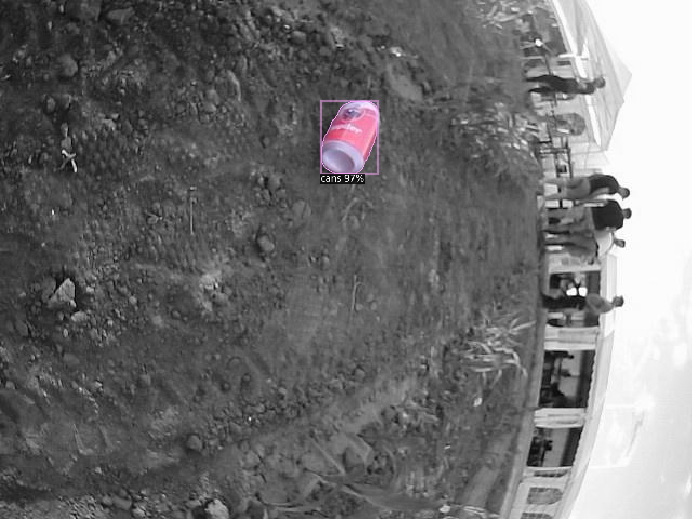
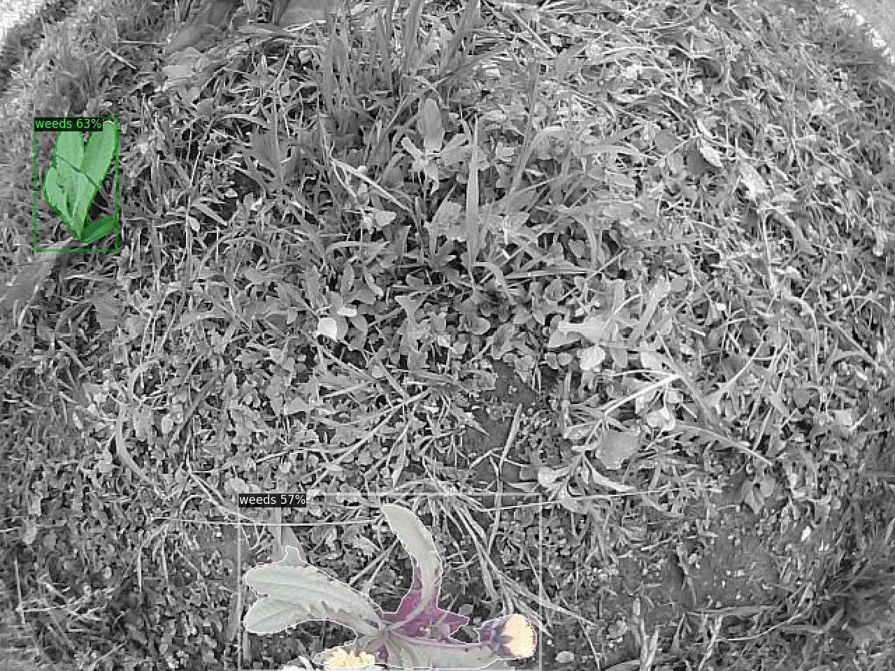
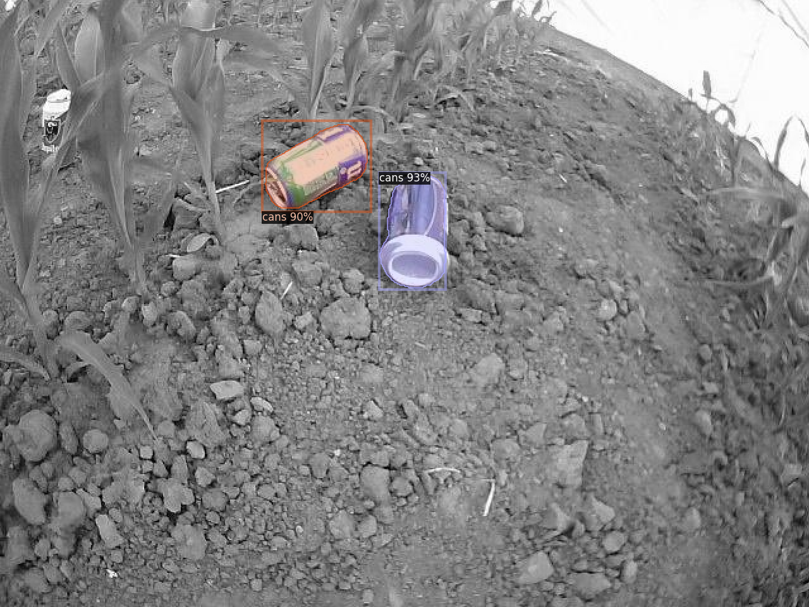

# Dandelion and cans detection
## Training
For training see `train_detectron.ipynb`.

## Deployment
See [official Detectron2 repository](https://github.com/facebookresearch/detectron2/tree/main/tools/deploy).

## Results

